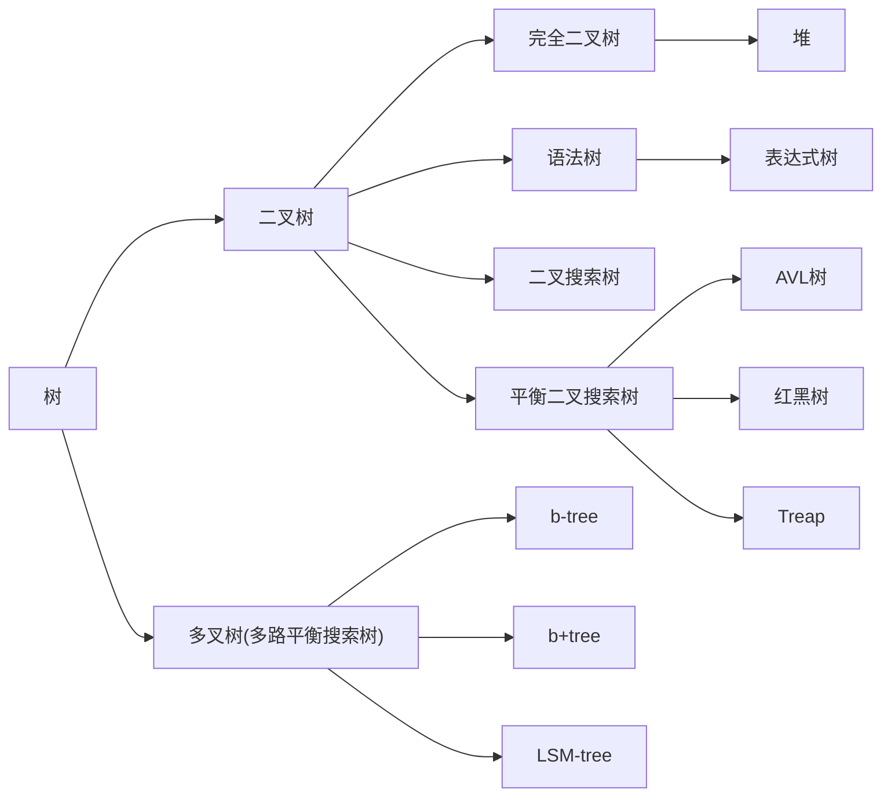

+ 术语：
+ 实现：
	+ 二叉树：两个指针
	+ 多叉树：一个结点表示最左边的儿子，另一个结点表示这个结点右边的兄弟。
	

```mermaid
graph LR;

树 --> 二叉树
树 --> 多叉树

二叉树 --> 完全二叉树
二叉树 --> 语法树
二叉树 --> 二叉搜索树

完全二叉树 --> 堆

语法树 --> 表达式树

二叉树 --> 平衡二叉搜索树
平衡二叉搜索树 --> AVL树
平衡二叉搜索树 --> 红黑树
平衡二叉搜索树 --> Treap

多叉树["多叉树(多路平衡搜索树)"] 
多叉树 --> btree[b-tree]
多叉树 --> bbtree[b+tree]
多叉树 --> LSMtree[LSM-tree]

```

+ 二叉搜索树：一种偏序树，每个结点的左子树的所有项“小于”该结点，右子树的所有项“大于”该结点
	+ 可能退化成链导致复杂度爆炸。