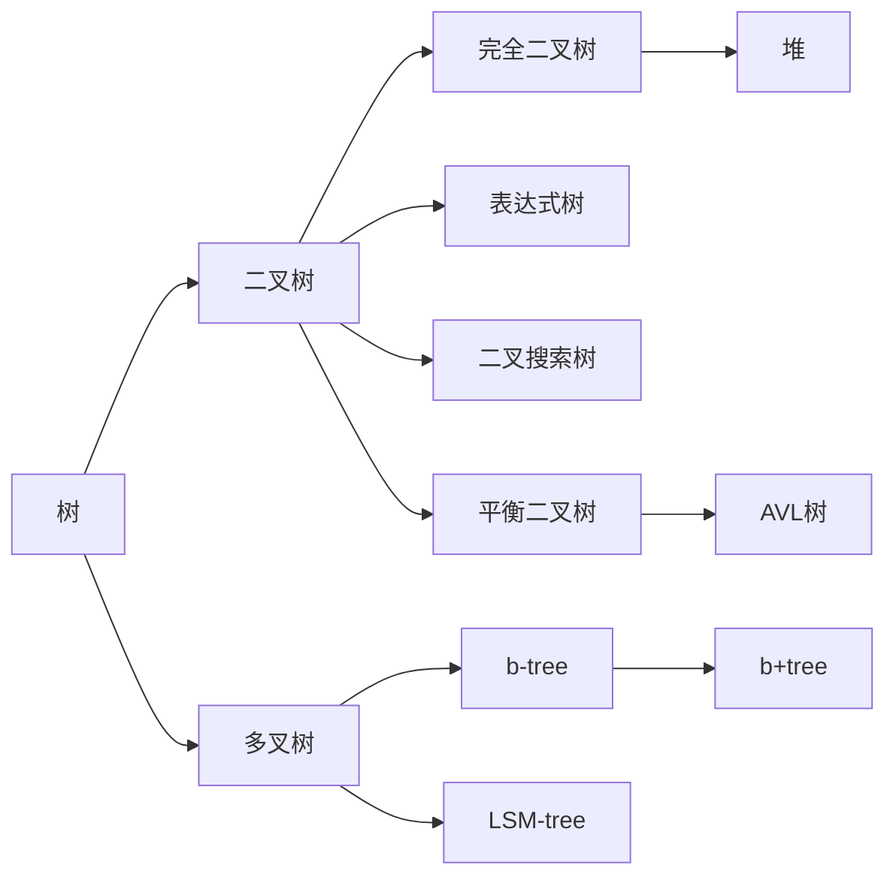

+ 相关术语：
+ 实现：
	```cpp
	struct TreeNode {
		Object element;
		TreeNode *firstChild;  // 最左边的孩子
		TreeNode *nextSibling;  // 右边的兄弟
	}
	```
	类似侵入式的前式链向星？


---

## Binary search tree
+ 定义：结点值为相互之间有**偏序关系**的值，对于每个结点其左子树的所有项的值都小于该结点、右子树的所有项的值都大于该结点

```c++
template<typename Object, typename Comparator=less<Object> > class BinarySearchTree {
public:
    BinarySearchTree();
    BinarySearchTree(const BinarySearchTree & rhs);
    ~BinarySearchTree() {
        makeEmpty();
    }
    
    const Comparable & findMin() const;
    const Comparable & findMax() const;
    
    bool contains(const Comparable & x) const {
        return contailns(x, root);
    }
    bool isEmpty() const;
    void printTree() const;
    
    void makeEmpty();
    void insert(const Comparable &x) {
		insert(x, root);
    }
    void remove(const Comparable &x) {
        remove(x, root);
    }
    
    const BinarySearchTree & operator= (const BinarySearchTree & rhs) {
        if (this != &rhs) {
            makeEmpty();
            root = clone(rhs.root);
        }
        return *this;
    }

private:
    struct BinaryNode {
        Comparable element;
        BinaryNode *left;
        BinaryNode *right;
    	
        BinaryNode(const Comparable & theElement, BinaryNode *lt, BinaryNode *rt) : element(theElement), left(lt), right(rt) {}
    };
    
    BinaryNode *root;
    Comparator isLessThan;
    
    void insert(const Comparable & x, BinartNode * & k) const {
        if (t == NULL) t = new BinaryNode(x, NULL, NULL);
        else if (isLessThan(x, t->element)) insert(x, t->left);
        else if (isLessThan(t->element, x)) insert(x, t->right);
        else ;  // Duplicate; do nothing
    }
    void remove(const Comparable &x, BinaryNode * &t) {
        if (t == NULL) return ;  // Item not found; do nothing
        if (isLessThan(x, t->element)) remove(x, t->left);
        else if (isLessThan(t->element, x)) remove(x, t->right);
        else if (t->left != NULL && t->right != NULL) {
			t->element = findMin(t->right)->element;
            remove(t->element, t->right);
        } else {
            BinaryNode *oldNode = t;
            t = (t->left != NULL) ? t->left : t->right;
            delete oldNode;
        }
    }
    BinaryBde * findMin(BinartNode *t) const {
		/*
        if (t == NULL) return NULL;
        if (t->left == NULL) return t;
        return findMin(t->left);
    	*/
        if (t != NULL)
            while (t->reight != NULL)
                t = t->right;
        return t;
    }
    BinaryBde * findMax(BinartNode *t) const;
    bool contains(const Comparable &x, BinaryNode *t) const {
        if (t == NULL) return false;
        else if (isLessThan(x, t->element)) return contains(x, t->left);
        else if (isLessThan(t->element, x)) return contains(x, t->right);
        else return true;  // Match
    }
    
    void makeEmpty(BinaryNode* &t) {
        if (t != NULL) {
            makeEmpty(t->left);
            makeEmpty(t->right);
            delete t;
        }
        t = NULL;
    }
    void printTree(BinaryNode *t) const;
	BinartNode * clone(BinaryNode *t) const {
        if (t == NULL) return NULL;
        return new BinaryNode(t->element, clone(t->left), clone(t->right));
    }   
}
```

+ 平均深度$O(logN)$：
	+ 证明：
		+ internal path length内部路径长
		+ $D(N)$具有N个结点的某棵树T的内部路径长且$D(1)=0$

		一棵N结点树是由一颗$i$结点左子树和一颗$N - i - 1$结点右子树以及深度为0的根结点组成，则可以递推  
		$D(N) = D(i) + D(N - i - 1 + N - 1$因为所有子树的大小都是等可能的出现  
		这对二叉查找树是成立的，因为子树的大小只依赖于第一个插入到树中的元素的相对的rank  
		但是对二叉树不成立，此时D（i）和D（N - i - 1）的平均值都是$\frac{1}{N}\sum_{j = 0}^{N - 1}D(j)$，故$D(N) = \frac{2}{N}[\sum_{j = 0}^{N - 1}D(j)] + N - 1$

+ 上面实现的问题：删除只从右子树开始，会出现，树的形态向左偏从而导致效率下降

## B-tree
