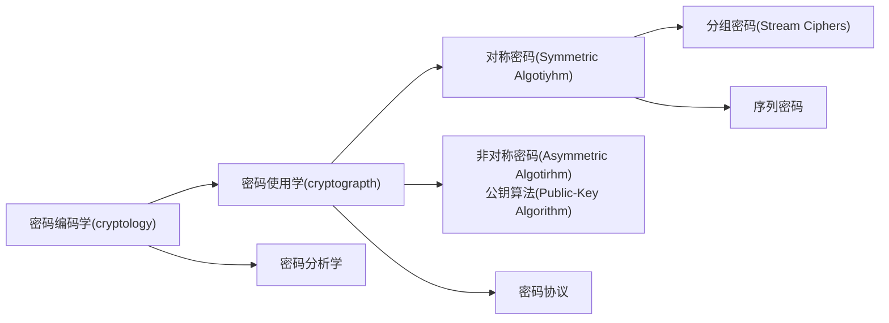

# Resume

+ 密码学分支：

  > 1949年之前称为古典密码学，1976年提出公钥密码学，之后称现代密码学。

+ 密码分析学：
	```mermaid
	graph LR;
		root["密码分析学"]
		son1["古典/经典密码分析(Classical Cryptanalysis)"]
		son2["实施攻击(Implementation Attack)"]
		son3["社会工程(Socail Engineering Attack)"]
		le1["数学分析法"]
		le2["蛮力攻击法"]
		
		root --> son1
		root --> son2
		root --> son3
		son1 --> le1
		son1 --> le2
	```

	+ 经典密码分析：将密文恢复到明文/从密文中恢复出密钥
		+ 数学分析：发现加密方法内部结构
		+ 蛮力攻击：把加密算法作为黑盒，测试所有可能密钥
	+ 实施攻击：对于从==旁道==获得的密钥，针对旁道/物理进行攻击
		>旁道：处理器功耗、电磁辐射

	+ 社会工程攻击：通过行贿、勒索、跟踪或刑侦等手段获得密钥

---

+ **Kerckhoffs原理**：即使除密钥外的整个系统的一切都是公开的， 这个密码体制也必须是安全的；尤其是即使攻击者知道系统的加密算法和解密算法，此系统也必须是安全的。
	+ 算法一般是公开的，虽然算法不公开更有利于保密，但是算法是未被测试的算法，把其公开更有利于对其分析

+ 密钥长度：
	+ 只在只能暴力的情况下，才讨论密钥长度，
	+ 数学分析法或者社会工程/实施攻击则不关心密钥长度
	+ 不同算法要求的密钥长度不同

# mod operator
$x \mid y \text{表示}x\text{整除}y$

定义
$$
\begin{align*}
& 假设a, r, m \in Z\text{(其中Z是所有整数的集)}，并且m > 0。如果 m 除 a-r  \\
& 可记作： \ a \equiv r  \ mod \  m \\
& 其中 m 称为模数，r称为余数
\end{align*}
$$

推导
$$
\begin{align}
& 存在 a \in Z，使得 \\
& a = q * m + r, 其中0 \le r < m \\
& 由于a - r = q * m(m \ 除 \ a - r)，上述表达式可写作：a \equiv r \ mod \ m(r \in {0, 1, 2, ..., m - 1})
& \end{align}
$$

+ 性质：
	+  等价类：对于给定模数m，有一个数集的任何一个元素对其取余结果同，该数集内元素为一个等价类
	+ 运算性质：分配律：加减法、乘法，没有除法
	+ 乘法逆元：$a^{-1}$：不是指a的倒数，是逆元的特殊符号：$a \times a^{-1} \equiv 1 \ mod \ m$，要求$gcd(a, \ m) = 1$（如果不互素无解）
		>用途：$(a / b)(mod \ m) = a * b^{-1}(mod \ m)$继而可使用分配律


## apply

+ 移位密码：
	$$\begin{align} e_k(x) = x + k \ mod \ m \\ d_k(y) = y - k \ mod \ m \end{align}$$
	+ 密钥空间：m

+ 仿射密码：
	$$\begin{align}& e_k(x) = y \equiv a * x + b \ mod \ m \\ & d_k(y) = x \equiv a ^ {-1} * (y - b) \ mod \ m\\ & k = (a, b), 且gcd(a, m) = 1 \end{align}$$
	+ 密钥空间：$a ^ {-1}的取值范围 \times m$
